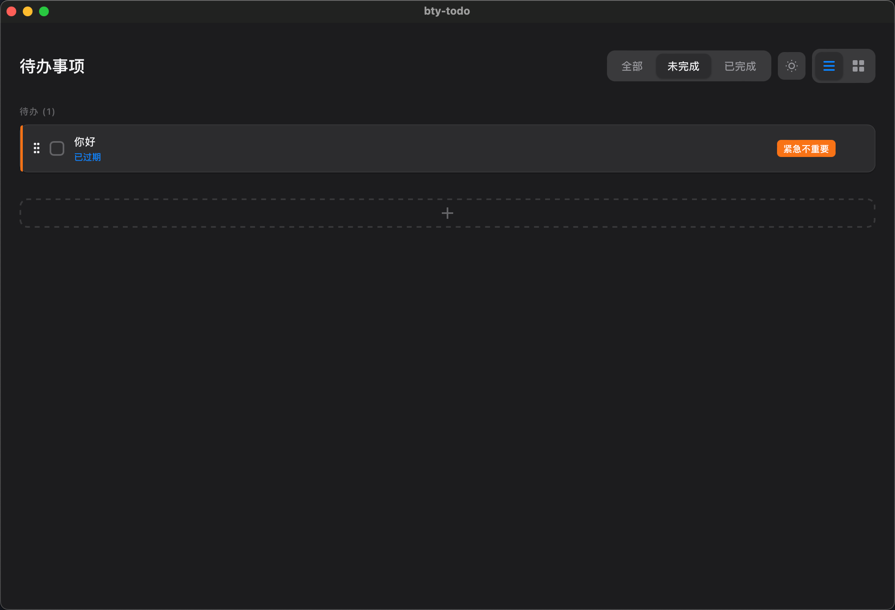
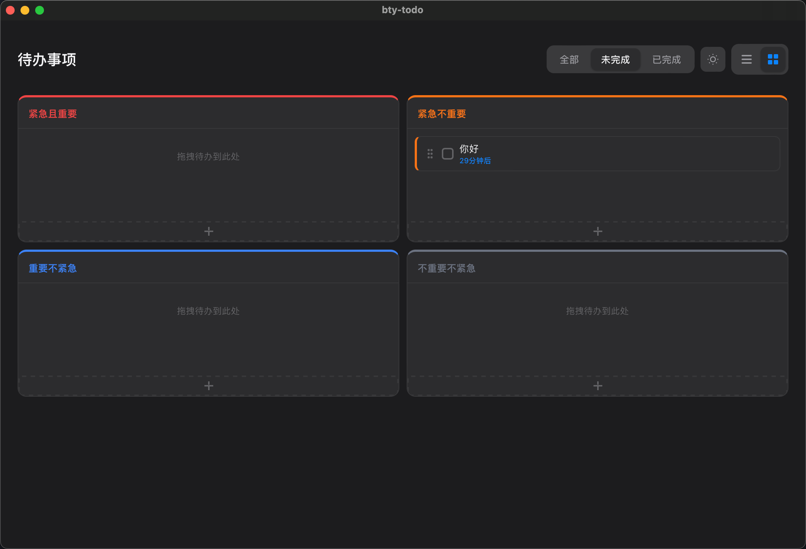
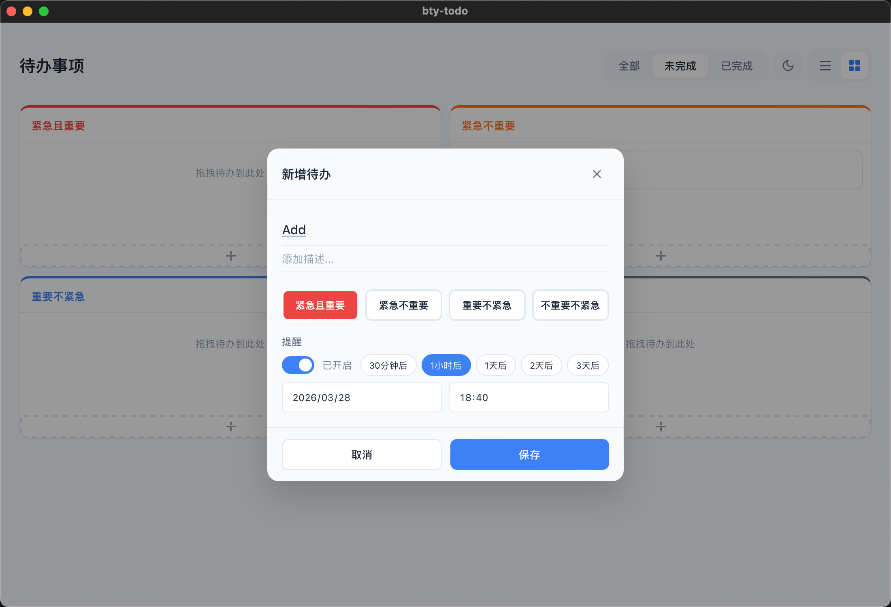

项目代码和文字都是在Trae IDE中使用MiniMax-M2.7模型 vibe coding出来的；图标是在Figma中下载的；

# 待办事项应用 (bty-todo)
一个基于 Tauri 2 框架的待办事项管理应用，支持四种优先级分类、提醒功能和双视图展示。

release : [dmg](https://github.com/bty834-2/bty-todo/releases/download/v1/bty-todo.dmg)








## 功能特性

### 优先级管理
- **紧急且重要 (P0)** - 红色标识，需要立即处理
- **紧急不重要 (P1)** - 橙色标识，尽快处理
- **重要不紧急 (P2)** - 蓝色标识，计划处理
- **不重要不紧急 (P3)** - 灰色标识，可延后处理

### 视图切换
- **列表视图** - 按时间顺序展示，支持拖拽排序
- **四象限视图** - 按紧急程度和重要性分为四个区域，支持拖拽调整优先级

### 筛选功能
- 全部 - 显示所有待办
- 未完成 - 只显示进行中的待办
- 已完成 - 只显示已完成的待办

### 提醒功能
- 快捷提醒：30分钟后、1小时后、1天后、2天后、3天后
- 自定义日期时间
- macOS 系统通知提醒

### 其他特性
- 明亮/暗黑模式切换
- 数据本地持久化存储
- 拖拽调整待办顺序和优先级
- 适配 macOS 和 Windows

## 技术栈

- **前端**: React + TypeScript + Vite
- **后端**: Tauri 2 (Rust)
- **样式**: CSS (支持暗黑模式)
- **拖拽**: @dnd-kit/core

## 项目结构

```
bty-todo/
├── src/                      # 前端源码
│   ├── components/           # React 组件
│   │   ├── TodoForm.tsx     # 待办表单弹窗
│   │   └── TodoItem.tsx     # 待办项组件
│   ├── types/               # 类型定义
│   │   └── todo.ts          # 待办相关类型
│   ├── utils/               # 工具函数
│   │   ├── api.ts           # Tauri API 调用
│   │   └── time.ts          # 时间格式化
│   ├── App.tsx              # 主应用组件
│   └── App.css              # 主样式文件
├── src-tauri/               # Tauri/Rust 后端
│   ├── src/
│   │   ├── lib.rs           # Rust 业务逻辑
│   │   └── main.rs          # 入口文件
│   ├── icons/               # 应用图标
│   ├── Cargo.toml           # Rust 依赖
│   └── tauri.conf.json      # Tauri 配置
├── SPEC.md                  # 详细规范文档
└── README.md                # 项目说明文档
```

## 开发

### 环境要求
- Node.js 18+
- Rust 1.70+
- macOS 10.13+ 或 Windows 10+

### 安装依赖
```bash
npm install
```

### 开发模式
```bash
npm run tauri dev
```

### 构建打包
```bash
npm run tauri build
```

### 数据存储位置
- **macOS**: `~/Library/Application Support/com.mamba.bty-todo/todos.json`
- **Windows**: `%APPDATA%\com.mamba.bty-todo\todos.json`

## 快捷键

| 操作 | 说明 |
|------|------|
| 点击新增按钮 | 创建新待办 |
| 点击待办项 | 编辑待办 |
| 点击复选框 | 切换完成状态 |
| 点击删除按钮 | 删除待办 |
| 拖拽待办 | 调整顺序/优先级 |

## License

MIT
